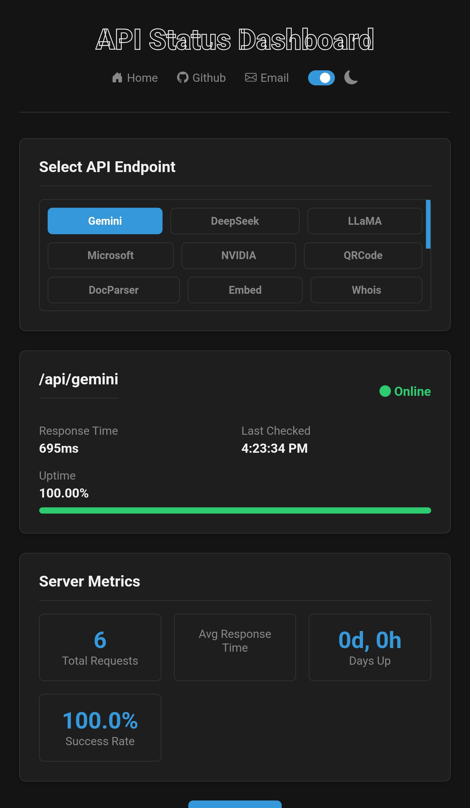
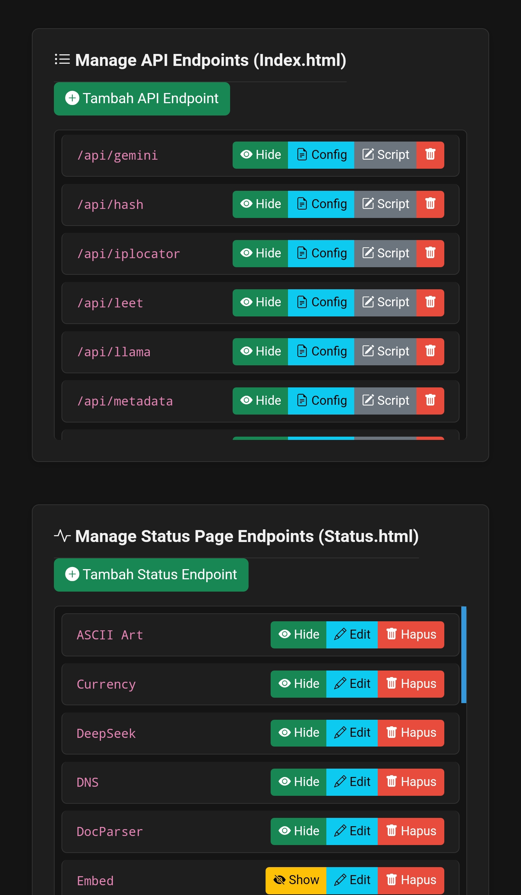

### API-MATIC

<p align="center">
  
  
  
</p>


---

RESTful API with `TryAPI` on Web, include Panel & Status.

---
#### Git
```bash
git clone https://github.com/SMMURDA/api-matic.git
```
```bash
cd api-matic && npm install
```
- Ubah .env sesuai dengan isinya
pertama lakukan :
```bash
cp .env.example .env
```
```bash
nano .env
```
- Ubah semua domain `https://matic.eu.org` yang ada pada folder `api-matic/public` :
`index.html` `status.html` `panel.html`
- Ubah juga semua domain `https://matic.eu.org` yang ada pada dokumentasi `api-matic/public/routes .json`
jika semua sudah sesuai, jalankan :
```bash
node server
```
###### Noted
Disarankan menggunakan `node v18.20` dan sedangkan `npm v10.8`

Downgrade atau upgrade bisa pakai ini :

###### Linux debian/ubuntu
```bash
sudo apt remove nodejs -y
```
```bash
curl -fsSL https://deb.nodesource.com/setup_18.x | sudo -E bash -
```
```bash
sudo apt install -y nodejs
```
```bash
node -v
```
###### Windows 2012 - 2022
`Via Powershell`
```bash
powershell -c "irm https://community.chocolatey.org/install.ps1|iex"
```
```bash
choco install nodejs-lts --version="18"
```
```bash
node -v 
```
```bash
npm -v 
```
###### Windows 2012 - 2022
`Via .msi/.exe`
```bash
https://nodejs.org/en/download
```
- Open link diatas pakai browser chrome/mozilla
- Lalu pilih node v18.20 for windows, setelah terdownload, lakukan penginstallan
- & jika sudah selesai check cmd pakai `node -v` dan wajib versi `18.20` yang tertera

Jika saat menjalankan server ada modul yang tidak terinstall, lihat errornya lalu npm install sesuai dengan error modul yang tertera.
```bash
npm install {nama modul}
```
#### Docker Image

```bash
docker pull smmurda/matic-api:latest
```

#### License 

This project is under the [MIT License](https://opensource.org/licenses/MIT).
